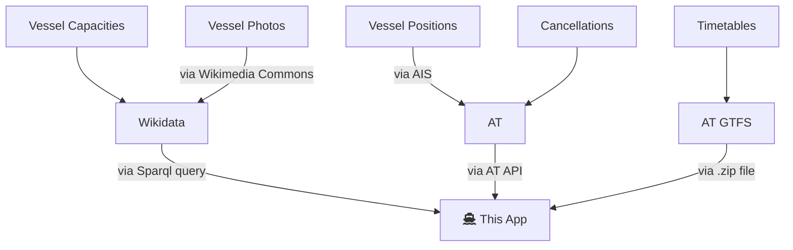

# Ferry Capacities

This app shows you which ferry is currently operating each route in Auckland, and how many passengers and bikes it can take.

It's quite common that the smaller ferries leave people behind because of their limited capacity. This App helps you judge whether to take the ferry or not.

# How it works

All this information is free and publicly available, but it's unfortunately not integrated into the official AT mobile app.

# Contributing to the code

If you just want to edit data about vessels, you can do that from [the Wikipedia page](https://en.wikipedia.org/wiki/List_of_Auckland_ferries).

To contribute to the code:

- install NodeJS v18+
- Install Visual Studio Code
- `cd` into the reposity
- run `npm install`
- run `npm run start` to start the server on http://localhost:8788
- open http://localhost:8788 in your web browser
